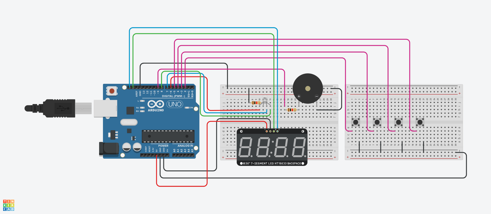

# キッチンタイマー

## システムの完成図

以下の図のようなキッチンタイマーを作成しました。

<table align=center>
  <tr>
    <td>
      
    </td>
  </tr>
</table>

## システムの概要

|id|入力|説明|
|-|-|-|
|1|スタートボタン ストップボタン|タイマー停止中に押すとタイマーが動作 タイマー動作中に押すとタイマーが停止|
|2|リセットボタン|動作中、停止中に関わらず押すとタイマーが初期状態に変わる|
|3|1分追加ボタン|動作中、停止中に関わらず押すと1分追加|
|4|10秒追加ボタン|動作中、停止中に関わらず押すと10秒追加|

|id|出力|説明|
|-|-|-|
|1|7セグメントディスプレイ|00:00～59:59までの時間を表示|
|2|3色LED|タイマー動作中、残り時間が30秒以上で青色、 30秒未満10秒以上で黄色、10秒未満の時、赤色に点灯|
|3|ブザー|00:00で5つの中からランダムで1つ曲を鳴らす|

__制約事項__ 
59分59秒以上は入力ができない。

(最終更新 2025/6/15)
